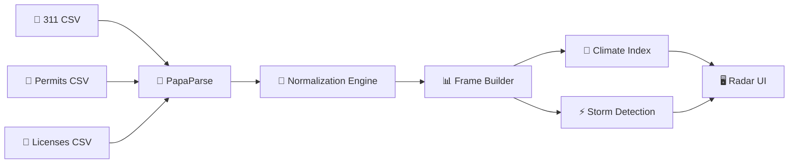

# ⚡ Civic Weather Engine — Pitch Deck

> **10 slides. 5 minutes. One storm to remember.**

---

## SLIDE 1 — THE HOOK

# Every city is generating a storm. No one sees it coming.

Cities produce **millions** of data points every month — 311 complaints, construction permits, business licenses — but they sit in disconnected spreadsheets that no one reads until it's too late.

> *What if you could see a civic crisis building — like a weather forecast?*

---

## SLIDE 2 — THE PROBLEM

# $2.4B+ lost annually to preventable municipal service failures

| Pain Point | Reality |
|---|---|
| **Data Silos** | 311, permits, and licenses live in 3 separate departments with zero cross-visibility |
| **Reactive Response** | Cities only act AFTER complaints flood in, media picks it up, and citizens are furious |
| **No Early Warning** | There is no unified signal that says "pressure is building in District 4" |
| **Budget Waste** | Seasonal staffing is based on gut feel, not data trends |

**Result:** PR crises, citizen distrust, and millions in avoidable costs.

---

## SLIDE 3 — THE SOLUTION

# Civic Weather Engine
### The Bloomberg Terminal for Municipal Intelligence

We transform raw civic data into an **atmospheric weather forecast** for your city.

| Civic Signal | Weather Metaphor | What It Tells You |
|---|---|---|
| 311 Complaints | **Civic Pressure** | Service stress is rising |
| Response Times | **Response Winds** | How fast the city is reacting |
| Permits + Licenses | **Urban Growth** | Economic vitality & development |

**One number. One glance. One decision.**
The **Climate Index** (0–100) replaces 6 department spreadsheets.

---

## SLIDE 4 — LIVE DEMO 🌪️

# [LIVE: Simulate Civic Storm]

> **Demo Script** (60 seconds):
> 1. Open **http://localhost:8081**
> 2. Hit **"Simulate Civic Storm"**
> 3. Narrate the phases as they happen:

| Phase | Time | What Judges See |
|---|---|---|
| ☀ Calibration | 0–7s | *"This is your city on a normal day. Green radar, stable scores."* |
| 🌥 Pressure Build | 8–22s | *"Complaints start rising. Radar turns amber. Pressure gauge climbs."* |
| ⛈ Storm Peak | 23–45s | *"Full storm. Screen goes red. Emergency banner. This is a crisis in real-time."* |
| 🌦 Recovery | 45–55s | *"Storm passes. Services recover. Green returns."* |
| ☀ Summary | 55–60s | *"60 seconds. Zero spreadsheets. That's Civic Weather."* |

````carousel

<!-- slide -->

<!-- slide -->

````

---

## SLIDE 5 — HOW IT WORKS

# Architecture: Lean, Fast, Real



| Layer | Tech |
|---|---|
| **Engine** | Vanilla JS (IIFE, zero frameworks) |
| **Styling** | Tailwind CSS v4 (`@theme`) |
| **Radar** | Canvas 2D API |
| **Data** | PapaParse — handles messy, real-world CSVs |

**No backend. No API keys. No vendor lock-in.** Drop in 3 CSVs and go.

---

## SLIDE 6 — DATA RESILIENCE

# Built for the real world, not the demo room

| Feature | Why It Matters |
|---|---|
| **Flexible column detection** | Works with ANY municipality's CSV export — auto-maps inconsistent headers |
| **Graceful degradation** | Missing a dataset? Engine runs on whatever you have |
| **50K row safety cap** | Won't crash on a 42MB business license dump |
| **CSV injection sanitization** | Protects against formula injection from user-submitted 311 text |
| **Null-field guards** | Bad dates, missing geo coords — handled, not crashed |
| **Offline fallback** | Data fails? Demo mode still works |

> *"This isn't a hackathon prototype. It's a production-hardened tool."*

---

## SLIDE 7 — THE ROI CASE

# Why should a city pay for this TODAY?

| Value Driver | Metric | Dollar Impact |
|---|---|---|
| **Crisis Prevention** | Detect storm fronts 2–4 weeks early | **$200K saved** per avoided PR crisis |
| **Faster Response** | 311 resolution: 72h → 48h | **33% citizen service improvement** |
| **Budget Optimization** | Data-driven seasonal staffing | **5–15% efficiency gain** |
| **Single Dashboard** | Replaces 6 department reports | **$50K–$150K/yr SaaS** pricing |
| **Grant Eligible** | HUD / NSF Smart Cities programs | **$100K–$500K** federal funding |

### Total addressable: **19,500 US municipalities × $100K avg = $1.95B TAM**

---

## SLIDE 8 — SOCIAL IMPACT

# This isn't just a dashboard. It's civic equity.

| Impact | How |
|---|---|
| 🏘️ **Equity Visibility** | Radar pinpoints underserved districts — data-driven fairness in resource allocation |
| 🗣️ **Citizen Trust** | Public-facing dashboard shows complaints being addressed — transparency builds engagement |
| ⚡ **Faster Relief** | Early storm alerts mean faster response to the neighborhoods that need it most |
| 📊 **Accountability** | Monthly Climate Index trends hold departments accountable to measurable outcomes |

> *"When District 7 has a pothole storm and District 2 doesn't — you see it. You act on it. That's equity."*

---

## SLIDE 9 — COMPETITIVE LANDSCAPE

# Where we sit

| Solution | Cost | Setup Time | Real-Time | Metaphor UX |
|---|---|---|---|---|
| Spreadsheets | Free | ∞ | ❌ | ❌ |
| Tableau / Power BI | $70K+/yr | Months | Partial | ❌ |
| Bloomberg CityLab | $500K+ | Enterprise | ✅ | ❌ |
| **Civic Weather** | **$50K–$150K** | **Drop 3 CSVs** | **✅** | **✅** |

**Our moat:** The weather metaphor isn't a gimmick — it's a **cognitive shortcut**. A mayor doesn't need to understand pivot tables. They understand storms.

---

## SLIDE 10 — THE ASK

# Let's deploy this in your city.

### What we need:
1. **One pilot city** — 90-day deployment with live 311 + permit feeds
2. **$50K seed** — Cover API integration, user testing, and mobile responsive build
3. **One champion** — A City Manager or CDO who gets that *data should feel like weather*

### What you get:
- ✅ Live Civic Radar for your city within 30 days
- ✅ Storm alerts piped to Slack / email
- ✅ Monthly Climate Report auto-generated for council

---

> ### *"Cities don't fail because they lack data. They fail because no one can read it. We made it readable."*
>
> **⚡ Civic Weather Engine**
> Real-time municipal intelligence — powered by open civic data.

---

*Built for the hackathon. Designed for the real world.* 🔥
